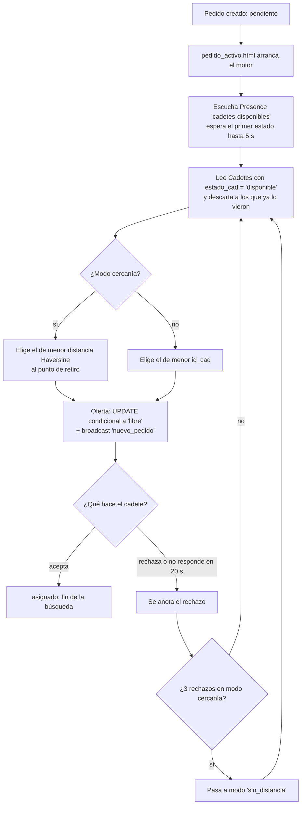

# Asignación de pedidos por cercanía

Cómo el motor de asignación (`scripts/script_asignacion.js`) elige a qué cadete ofrecerle un pedido nuevo.
La especificación completa del motor, los estados y los canales está en
[`contrato_app_cadetes.md`](contrato_app_cadetes.md) (sección 7); acá se explica la regla de cercanía y lo
que hay que saber para mantenerla.

---

## La regla en tres líneas

1. El pedido se ofrece **a un solo cadete por vez**, primero al **cadete libre más cercano al punto de retiro**.
2. Si **3 cadetes seguidos** no lo toman (rechazan o no responden), se sigue ofreciendo **sin tener en cuenta
   la distancia**, en orden de `id_cad`, como hacía el motor antes.
3. Quién está libre lo decide siempre la **BD** (`Cadetes.estado_cad = 'disponible'`). De Realtime solo se
   toma la **ubicación**.

---

## Paso a paso



1. **El pedido nace `pendiente`**, sin cadete (`crear_pedido.html`). La página de seguimiento
   (`pedido_activo.html`) llama a `iniciarBusquedaCadete(id_pedido)`.
2. **El motor se suscribe a Presence del canal `cadetes-disponibles`** solo para escuchar (no hace `track`,
   así el cliente no aparece como un cadete más). Antes de la primera oferta espera el primer estado de
   Presence hasta `ESPERA_UBICACIONES_MS` (5 s). Normalmente llega en menos de un segundo y la oferta sale enseguida.
3. **Lee de la BD los cadetes `disponible`** que todavía no vieron este pedido en esta búsqueda.
4. **Elige al cadete:**
   - **Modo `cercania`** (el inicial): calcula la distancia de cada cadete libre al punto de retiro y elige el
     menor. Los que no tienen ubicación real quedan al final, por `id_cad`. A igual distancia gana el menor `id_cad`.
   - **Modo `sin_distancia`**: el primer libre por `id_cad`.
5. **Oferta**: `UPDATE Pedidos SET id_cadete = X, estado_pedido = 'libre'` solo si el pedido sigue sin oferta
   vigente (bloqueo optimista), y broadcast `nuevo_pedido` al canal `pedidos-cadete-X`.
6. **Respuesta del cadete**:
   - Acepta → `asignado`, termina la búsqueda.
   - Rechaza, no responde en `TIMEOUT_OFERTA_MS` (20 s) o devuelve la oferta porque está ocupado → se anota,
     no se le vuelve a ofrecer en esta búsqueda y, si el modo es `cercania`, **suma un rechazo cercano**.
7. **Al llegar a `RECHAZOS_MAX_CERCANIA` (3) rechazos cercanos** el motor pasa a `sin_distancia` y cierra el
   canal de Presence (ya no lo necesita).
8. **Si no queda nadie libre**: espera hasta 60 s a que se libere un cadete ocupado; si no, cancela el pedido
   con el motivo correspondiente ("Todos los cadetes rechazaron el pedido", "Ningún cadete se liberó a tiempo",
   "No hay cadetes conectados").

---

## De dónde sale la ubicación de cada cadete

La tabla `Cadetes` no guarda ubicación. Cada cadete en turno la publica por **Realtime Presence** en el canal
`cadetes-disponibles` desde la app de cadetes (`SistemaCadetes/Scripts/conexion_rt_pedidos_entrantes.js`), y la
actualiza con cada lectura del GPS:

| Campo | Qué es |
|---|---|
| `id_cad` | id del cadete (la key de Presence es `cad_{id_cad}`) |
| `coords` | `{ lat, lng }` |
| `coords_ts` | hora (ms) del último fix GPS real. **`null` mientras el cadete transmite la ubicación por defecto** (centro de San Juan) porque todavía no tiene GPS o no dio permiso |
| `estado_cad`, `nombre`, `patente`, `vehiculo_cad` | informativos (el motor no los usa) |

El motor **solo usa `coords` que tengan `coords_ts`**. Sin ese campo, un cadete sin GPS parecería estar en el
centro y "ganaría" pedidos que no le corresponden. Si un cadete tiene el dashboard abierto en varias pestañas,
se usa la presencia con el `coords_ts` más nuevo.

> Si se cambia el nombre del canal o de `coords_ts`, hay que cambiarlo en **los dos repos**.
> `npm run verificar` avisa si desaparecen del código de clientes.

---

## La distancia

- Fórmula de **Haversine** (radio medio de la Tierra 6371 km): distancia **en línea recta**, no por calles.
- Se mide **desde la ubicación del cadete hasta el punto de retiro** (`latitud_org`, `longitud_org`), porque
  es adonde tiene que ir primero.
- Si el pedido no tiene coordenadas de retiro, no se puede medir y se ofrece por `id_cad`.

---

## Qué cuenta como "rechazo cercano"

| Situación | ¿Cuenta? |
|---|---|
| El cadete toca "Rechazar" | Sí |
| El modal del cadete vence (15 s) o no responde en 20 s | Sí |
| El cadete está ocupado (otra oferta, otro viaje o aceptando otro pedido) y la devuelve | Sí |
| El cliente cancela el pedido | No (termina la búsqueda) |
| Ofertas hechas ya en modo `sin_distancia` | No (ya no se cuenta) |

El contador vive **en memoria**, en la búsqueda. Si el cliente recarga `pedido_activo.html`, la búsqueda se
reanuda y el contador vuelve a cero (igual que la lista de cadetes que ya rechazaron).

---

## Casos especiales

| Caso | Qué pasa |
|---|---|
| Cadete sin permiso de GPS o sin señal todavía | Recibe ofertas igual, pero después de los que tienen ubicación |
| Presence no conecta | Se ofrece igual a los 5 s: todos quedan "sin ubicación" y el orden es por `id_cad` |
| Ningún cadete libre, pero hay ocupados | Espera hasta 60 s a que se libere uno; el primero que se libera recibe la oferta |
| Nadie en turno | Se cancela al instante: "No hay cadetes conectados" |
| Varios pedidos del mismo comercio a la vez | Todos apuntan al mismo cadete cercano y la primera oferta que le llega queda abierta. Los otros motores lo ven `en_confirmacion` en la BD y pasan al siguiente más cercano; si alcanzaron a ofrecérselo, él lo devuelve como "ocupado" (cuenta como rechazo cercano) |
| Presence llega tarde (después de la primera oferta) | Esa primera oferta sale por `id_cad`; las siguientes ya usan la ubicación |
| El cliente cierra el seguimiento más de 30 min | Al volver, la búsqueda se cancela ("La búsqueda de cadete venció") en vez de ofrecerse tarde |

---

## Configuración

En `CONFIG_ASIGNACION` (`scripts/script_asignacion.js`):

| Clave | Valor | Para qué |
|---|---|---|
| `RECHAZOS_MAX_CERCANIA` | `3` | Rechazos cercanos antes de pasar a asignar sin distancia |
| `ESPERA_UBICACIONES_MS` | `5000` | Espera máxima al primer estado de Presence antes de la primera oferta |
| `TIMEOUT_OFERTA_MS` | `20000` | Tiempo para que el cadete responda. Tiene que ser **mayor** que el modal del cadete (15 s) |
| `INTERVALO_REVISION_MS` | `3000` | Latido de respaldo por si se pierde un evento realtime |
| `ESPERA_MAX_OCUPADOS_MS` | `60000` | Espera a que se libere un cadete ocupado antes de cancelar |
| `VENCIMIENTO_BUSQUEDA_MS` | 30 min | Un pedido sin cadete después de esto se cancela en vez de ofrecerse |

---

## Qué ve el cliente

El motor no toca el DOM: emite eventos y `pedido_activo.html` los muestra.

| Momento | Título | Detalle |
|---|---|---|
| Esperando ubicaciones | Buscando el cadete más cercano | Ubicando a los cadetes en turno |
| Oferta enviada | Ofreciendo a {nombre} | Enviando oferta • a 850 m del retiro • Intento 1 |
| El cadete la está viendo | Ofreciendo a {nombre} | Viendo la oferta • a 1,2 km del retiro • Intento 2 • 12s |
| Todos ocupados | Todos los cadetes están ocupados | Esperando que se libere uno • 45s |

La distancia solo aparece cuando la oferta se hizo por cercanía y el cadete tenía ubicación.

---

## Lo que tiene que cumplir la app de cadetes

Además del contrato general (sección 7.8 de `contrato_app_cadetes.md`):

- **Publicar `coords` y `coords_ts` en Presence** mientras está en turno (`conexion_rt_pedidos_entrantes.js`).
- **Mantener `estado_cad` confiable**, porque es la disponibilidad que usa el motor (`Templates/dashboard.html`):
  - las escrituras salen de a una y en orden (`escribirEstadoCad`);
  - abrir y cerrar ofertas solo mueve `disponible` ↔ `en_confirmacion` y nunca pisa un `ocupado`;
  - desde que el cadete toca "Aceptar" hasta que entra al viaje, toda oferta nueva se devuelve (`aceptandoPedido`);
  - antes de aceptar, se verifica que no tenga otro viaje en curso (caso dashboard abierto en dos pestañas).
- **Cambios de estado del viaje condicionales** (`conexion_rt_pedido_en_curso.js`): `en_camino_entrega` solo
  desde `asignado`, `entregado` solo desde `asignado`/`en_camino_entrega`.

---

## Cómo verificarlo

**En la consola del navegador del cliente** (página de seguimiento):

```
[Asignación] Pedido #12: ofreciendo a cadete #3 (intento 1, a 0.80 km del retiro).
[Asignación] Pedido #12: cadete #3 rechazó.
[Asignación] Pedido #12: ofreciendo a cadete #5 (intento 2, a 1.40 km del retiro).
...
[Asignación] Pedido #12: 3 cadetes cercanos no lo tomaron, se asigna sin tener en cuenta la distancia.
[Asignación] Pedido #12: ofreciendo a cadete #1 (intento 4, sin tener en cuenta la distancia).
```

Si un cadete aparece "sin ubicación conocida", no está publicando `coords_ts` (sin GPS o sin permiso).

**Pruebas manuales**: `contrato_app_cadetes.md`, sección 12. Las de cercanía son la 1 a la 4; las del dashboard
en dos pestañas y de aceptar con otra oferta en camino, la 14 a la 16.

**Antes de cada commit**: `npm run verificar`.

---

## Pruebas de estrés realizadas

Antes de publicar el cambio se simularon **4000 corridas** con el código real del motor y de la conexión
realtime del cadete, sobre un Supabase simulado. Se usaron 8 escenarios: uso normal, estrés, red muy mala
(hasta 6 s por viaje de red y 50 % de mensajes realtime perdidos), el mismo pedido en dos dispositivos, cadete
con dos pestañas, cliente que abandona el seguimiento, muchos pedidos del mismo comercio y respuestas al límite
del tiempo. En ninguna corrida:

- un pedido quedó aceptado por dos cadetes, ni un cadete con dos viajes;
- se pisó la oferta de otro cadete ni hubo transiciones de estado inválidas;
- quedó un pedido o una búsqueda colgados;
- se ofreció un pedido vencido.

La oferta fue al cadete más cercano en el 99 % de los casos con uso normal y en el 88 % con la red muy mala.
Cuando no acierta es porque el motor decide con datos de hace un viaje de red: el cadete se movió o cambió
de estado mientras tanto.

---

## Limitaciones conocidas

- **Distancia en línea recta**, no por calles: un cadete del otro lado de una avenida sin cruce puede "ganar"
  aunque tarde más.
- **El motor corre en el navegador del cliente**, que por eso escucha Presence de `cadetes-disponibles` y
  puede ver la posición de todos los cadetes en turno. Se resuelve moviendo el motor a una Edge Function o
  haciendo privado el canal.
- **El contador de rechazos se reinicia** si el cliente recarga la página de seguimiento.
- **Dos viajes a la vez**: la app lo evita, pero si el cadete aceptara dos ofertas distintas en dos pestañas en
  el mismo instante queda una ventana mínima. Para cerrarla del todo se puede crear este índice en Supabase
  (antes, confirmar que ningún cadete tenga hoy dos pedidos en viaje):

  ```sql
  create unique index if not exists pedidos_un_viaje_activo_por_cadete
    on public."Pedidos" (id_cadete)
    where estado_pedido in ('asignado', 'en_camino_entrega');
  ```

---

## Archivos involucrados

| Repo | Archivo | Qué hace |
|---|---|---|
| SistemaClientes | `scripts/script_asignacion.js` | Motor: elección por cercanía, contador de rechazos, Presence |
| SistemaClientes | `templates/pedido_activo.html` | Arranca el motor y muestra su estado |
| SistemaClientes | `docs/contrato_app_cadetes.md` | Especificación completa (sección 7) |
| SistemaCadetes | `Scripts/conexion_rt_pedidos_entrantes.js` | Publica `coords` y `coords_ts` en Presence |
| SistemaCadetes | `Templates/dashboard.html` | Ofertas del lado del cadete y `estado_cad` |
| SistemaCadetes | `Scripts/conexion_rt_pedido_en_curso.js` | Estados del viaje (condicionales) |
